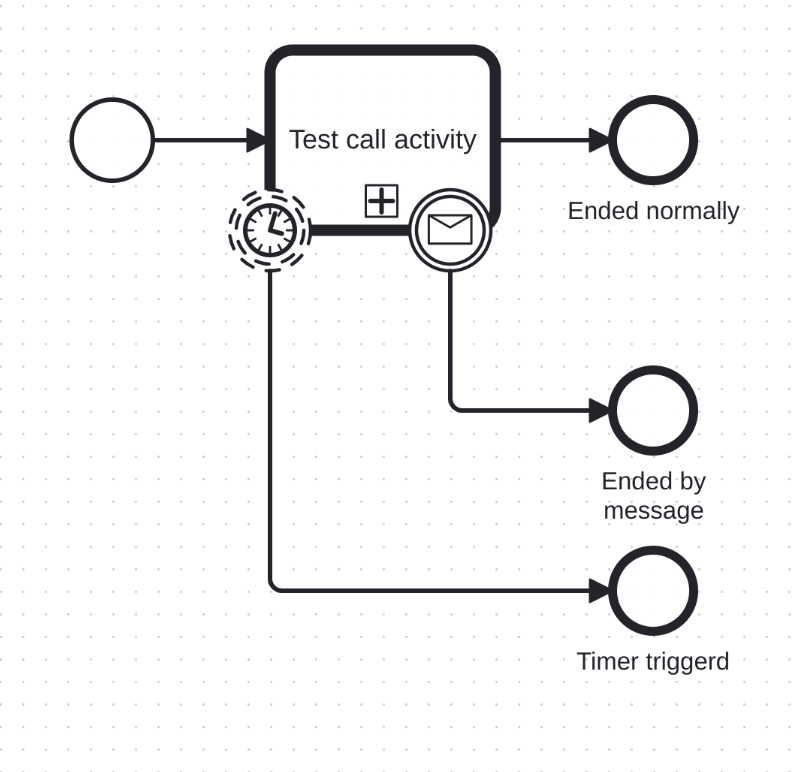

# BPMN engine

BPMN engine tries to adhere to the [bpmn 2 specification](https://www.omg.org/spec/BPMN/2.0.2/PDF) and be compatible with [Camunda 8](https://docs.camunda.io/).
The engine can be used through the ZenBPM platform or as a [standalone library](https://pkg.go.dev/github.com/pbinitiative/zenbpm/pkg/bpmn).

The engine is fully instrumented via [OpenTelemetry](https://opentelemetry.io/):

- Tracing: Each process, token, and flow node has spans.
- Metrics: Tracks counts of started, ended processes, worker executions etc.

## Storage

The engine uses a storage interface to interact with storage systems. ZenBPM platform implements a solution based on RqLite database. The codebase also provides a default implementation for in [memory storage](https://pkg.go.dev/github.com/pbinitiative/zenbpm/pkg/storage/inmemory) that is used by the engine's Unit tests.

## Node processing in the engine

Internally the engine uses "Tokens" as a pointers that traverse the diagram and represent execution state.
Tokens are manipulated based on node logic (e.g., split for gateways, wait for messages/timers).
One loop through the engine's main loop means processing the token's flow node and outgoing sequence flows.

### Execution Tokens

Tokens (ExecutionToken) track progress through flow nodes:

- `Key`: Unique identifier.
- `ElementId`: ID of the current BPMN element.
- `State`: Running, Waiting, Completed, Failed.

### Exclusive Gateway example

The following example shows processing of an Exclusive Gateway.

```mermaid
flowchart LR
 subgraph s1["Token execution"]
        n0["Previous node"]
        n1["Exclusive gateway"]
        n2["Node2"]
        n3["Node3"]
  end
    n0 -->|Token key 42 running|n1
    n1 L_n1_n2_0@-->|Token key:42</br>state:running|n2
    n1 --> n3

    n1@{ shape: diam}
     n0:::Hidden
     n2:::Hidden
     n3:::Hidden
    classDef Hidden stroke-width:1px, stroke-dasharray:none, opacity: 10%
    linkStyle 0 opacity: 50%

    L_n1_n2_0@{ animation: fast }
```

Since Exclusive Gateway cannot create parallel flows the token gets reused and continues to flow through the diagram.

### Parallel Gateway example

The following example shows processing of a Parallel Gateway.

```mermaid
flowchart LR
 subgraph s1["Token execution"]
        n0["Previous node"]
        n1["Parallel gateway"]
        n2["Node2"]
        n3["Node3"]
  end
    n0 L_n0_n1_0@-->|Token key:42</br>state:completed|n1
    n1 L_n1_n2_0@-->|Token key:43</br>state:running|n2
    n1 L_n1_n3_0@-->|Token key:44</br>state:running|n3

    n1@{ shape: diam}
     n0:::Previous
     n2:::Hidden
     n3:::Hidden
    classDef Hidden stroke-width:1px, stroke-dasharray:none, opacity: 10%
    classDef Previous stroke-width:1px, stroke-dasharray:none, opacity: 50%
    linkStyle 0 opacity: 50%

    L_n1_n2_0@{ animation: fast }
    L_n1_n3_0@{ animation: fast }
```

To keep track of the parallel executions the token that activated the gateway is completed and outgoing parallel flows get assigned a new tokens that each represents a parallel execution flow.

## Interacting with the BPMN engine

## Workers

## Supported elements

TODO: we should split these into separate pages with examples.

### Start event

Start event is fully supported.

### End event

End event is fully supported.

### Service task

Fully supported through external workers.

### User task

Fully supported through external workers.

### Business rule task

:::note[Future plans]
Supported through internal [dmn engine](/reference/dmn-engine).
:::

### Call activity

The subprocess for call activity is started on the same partition as the process that invoked it.

### Parallel gateway

Current implementation handles parallel flows correctly if there is only one overlapping flow in the process instance. **Multiple recursive parallel flows have currently undefined behaviour.**

### Inclusive gateway

Inclusive gateway is fully supported.

### Exclusive gateway

Exclusive gateway is fully supported.

### Event based gateway

Event based gateway currently supports message and timer events.

### Message catch event

Message catch event is fully supported.

### Link intermediate throw event

Link intermediate throw event is fully supported.

### Link intermediate catch event

Link intermediate catch event is fully supported.

### Timer intermediate catch event

Tiemr intermediate catch event is fully supported.
:::note[Future plans]

### Message throw event

### Error event

### Boundary event

Boundary events of supported event types are supported. The boundary event subscriptions are created at the time of token reaching `waiting state`.

Both **interrupting** and \*_non-interrupting_ boundary events are supported.

Currently supported activity types with boundary events:

- ServiceTask,
- SendTask,
- UserTask,
- BusinessRuleTask,
- CallActivity

Currently supported event types with boundary events:

- Message,
- Timer

_Boudary event usage example_

### Activity multi instance

### Script task

:::

## XML parser

TODO: add information about how we are parsing xml definitions of processes
