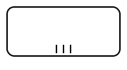

# Activity Multi-Instance

An Activity Multi-Instance is a BPMN activity configuration that allows an activity to be executed multiple times for a collection of items. It is used to model repeated execution of the same activity, either sequentially or in parallel, based on defined loop characteristics.

Multi-instance behavior can be applied to tasks, sub processes and call activities.

## Starting a Multi Instance
A Multi-Instance configuration acts as a wrapper around the activity and controls how it is repeated and completed.

**Input Collection:** Specifies the collection that the Multi-Instance activity iterates over. A new instance of the wrapped activity is created for each element in this collection. Each iteration processes a single element from the collection.

**Output Collection:** Specifies the collection that aggregates results from all iterations. The collection becomes available after the entire Multi-Instance execution completes.

**Output Element:** Defines the result produced by a single iteration of the Multi-Instance activity. This value is derived from variables within the iteration scope.

### Completion Condition

**Completion Condition:** Defines a condition that can complete the entire Multi-Instance execution before all iterations finish. The condition is evaluated after each iteration completes. If the condition evaluates to true, all remaining iterations are cancelled.

There are defined parameters available to be used in Completion Condition as numberOfInstances, numberOfActiveInstances, numberOfCompletedInstances. These are available only during the condition check.

**numberOfInstances:** Total number of instances created for the Multi-Instance activity.

**numberOfActiveInstances:** Number of currently active (not yet completed) instances.

**numberOfCompletedInstances:** Number of instances that have already completed.

**numberOfTerminatedInstances:** not supported yet. ( its zero )

## Engine Behavior
A Multi Instance behaves similarly to an independent process, but it is logically connected to the parent process instance.

When a Multi Instance is triggered:
- A new process instance is created.
- The new instance is linked to its parent process instance.
- The child process runs in its own isolated scope executing only its given task, sub process or call activity in a loop.

The child process for Multi Instance is started on the same [partition](/reference/cluster) as the parent process that invoked it.

In case of **Parallel** Multi Instance the behavior is the same expect the instances are all started at the start of the Multi Instance process. 

#### Variable Handling
By default, no variables are inherited from the parent process instance.
The child process operates within its own variable scope using variables from **Input Collection**.
Upon completion **Output Elements** are collected and aggregated to **Output Collection** which is then propagated into parent instance.

## Input/Output
Input and Output parameters still belong to its task, subprocess or call activity. These mappings control the variable scope at the start and end of the task, subprocess or call activity that is run in Multi Instance.

## Boundary Events
Boundary Events can be attached to a Multi Instance element to handle exceptional situations or alternative flows during its execution.
Interrupting Boundary Events cause Multi Instance to terminate and the parent process continues execution along the Boundary Event’s outgoing flow.

## Key characteristics

- **Multiple executions of the same activity:**  
  The activity is executed once for each element in a defined collection.

- **Sequential or parallel execution:**  
  A Multi-Instance activity can be configured to execute:
  - **Sequentially:** instances are executed one after another.
  - **In parallel:** all instances are executed at the same time.

- **Collection-based:**  
  The number of instances is determined by a collection or an expression evaluated at runtime.

- **Shared activity definition:**  
  All instances share the same activity definition but have their own execution context.

- **Completion condition (optional):**  
  The activity may define a completion condition that allows the multi-instance execution to finish before all instances complete.

- **Applicable to multiple activity types:**  
  Multi-instance behavior can be applied to Tasks and Subprocesses.

## Execution behavior

- For **parallel multi-instance**, multiple tokens are created, one for each instance.
- For **sequential multi-instance**, a single token is reused to execute instances one after another.
- The activity completes when:
  - all instances finish, or
  - the defined completion condition evaluates to true.

## Supported activity types

Multi-instance behavior can be applied to the following activity types:

- Task
- UserTask
- ServiceTask
- SendTask
- ReceiveTask
- BusinessRuleTask
- ScriptTask
- ManualTask
- SubProcess
- CallActivity

## Graphical notation

A standard activity shape with a **multi-instance marker** at the bottom center:

- **Three vertical lines:** parallel multi-instance



- **Three horizontal lines:** sequential multi-instance


## XML Definition

### Parallel multi-instance example

```xml
<bpmn:userTask id="ReviewTask" name="Review Document">
  <bpmn:multiInstanceLoopCharacteristics isSequential="false">
    <bpmn:loopCardinality>5</bpmn:loopCardinality>
  </bpmn:multiInstanceLoopCharacteristics>
</bpmn:userTask>
