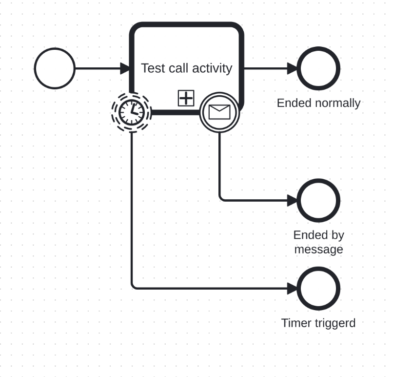

# Boundary event

Boundary events of supported event types are supported. The boundary event subscriptions are created at the time of token reaching `waiting state`.

Both **interrupting** and **non-interrupting** boundary events are supported.

Currently supported activity types with boundary events:

- ServiceTask,
- SendTask,
- UserTask,
- BusinessRuleTask,
- CallActivity

## Current Implementation
Currently supported event types with boundary events:

- Message,
- Timer

_Boundary event usage example_
:::note[Future plans]